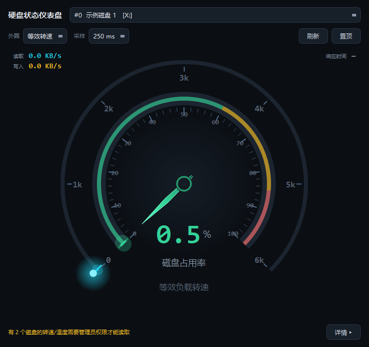
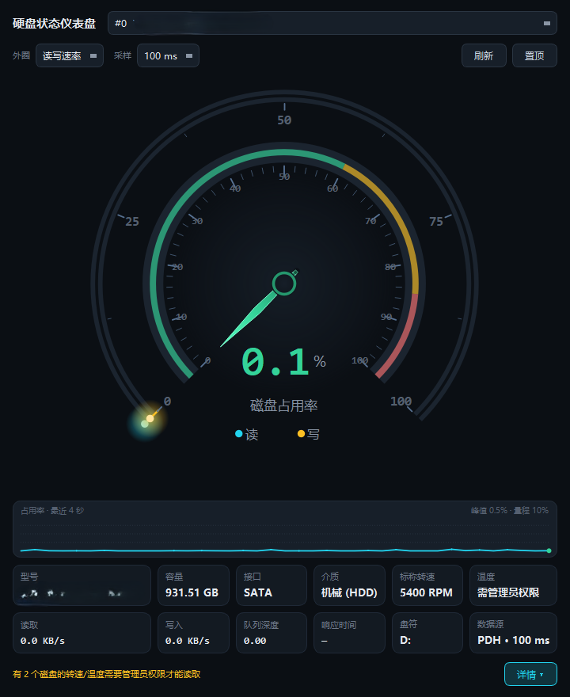
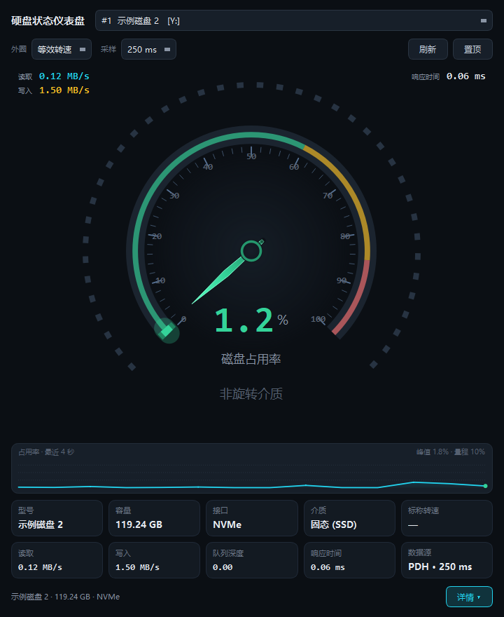

# HddGauge · 机械硬盘状态仪表盘

一个 Windows 桌面小工具，把一个物理硬盘的实时工作状态压缩成
一个一眼就能看懂的仪表盘：**主指针 = 磁盘占用百分比**，**外圈 = 等效负载转速 或 读写速率（可切换）**。


| 折叠详情（简洁模式） | 外圈：读写速率 | SSD（非旋转介质） |
|---|---|---|
|  |  |  |


---

## 1. 显示数据
* **等效负载转速**（默认）—— 把标称转速当作 100% 负载的参考点，
  `等效转速 = 标称转速 × min(1, 占用率 × (1 + 0.25 × min(队列深度, 4)))`。
  指针会随负载实时摆动，视觉上最直观，但它是**推导值**，界面上用「等效负载转速」明确标注。
* **读写速率** —— 外圈变成双环：青色 = 读，琥珀色 = 写，量程按峰值自动分档（1/2/5×10ⁿ）。
SSD/NVMe 会被识别为非旋转介质，转速外圈自动退化成虚线圈并标注「非旋转介质」，不再显示假刻度。

---

## 2. 功能

* **主表盘**：270° 弧形，0–100%，绿(<60)/黄(60–85)/红(≥85) 三段色区，
  指针用**临界阻尼弹簧**以 60 fps 追踪采样值，不会跳变。
* **外圈双模式**：等效负载转速 / 读写速率，右键菜单或顶部下拉切换，选择被记住。
* **多物理盘**：下拉框切换 PhysicalDrive，自动优先选中机械盘；支持热刷新。
* **角落常驻读数**：表盘左上角固定显示**读/写速率**，右上角固定显示**响应时间**
* **可折叠详情面板**：
  右键菜单里还可以把曲线图和参数栏**分开**开关。
* **采样频率可调**：100 / 200 / 250 / 500 ms、1 s、2 s，默认 250 ms。
  当前速率显示在参数栏的「数据源」格（如 `PDH · 250 ms`）。
* **信息面板**：型号、容量、接口、介质、标称转速、读、写、队列深度、响应时间、盘符。
* **60 秒滚动曲线**：占用率折线 + 峰值；纵轴按峰值自适应（空闲盘 0.2% 也能看出形状），
* **系统托盘**：悬停显示占用率/读写速率，双击显隐。
* **窗口置顶**、几何尺寸与设置通过 `QSettings` 持久化；启动尺寸不会超过屏幕可用区域。
* **`--selftest`**：无界面跑通整条采集链并输出报告，便于在别的机器上验证环境。
* **`--screenshot`**：把窗口离屏渲染成 PNG，便于评审界面。
---

## 3. 构建

### 依赖

* Qt 5.8（`mingw53_32` kit）
* MinGW 5.3.0 32-bit（随 Qt 安装包附带）
* 无需额外第三方库；PDH 通过 `-lpdh` 链接

工具链路径**没有写死**。两个脚本都先读环境变量 `QT_DIR` / `MINGW_DIR`，

### 一键脚本

```bat
build.bat          :: 开发版（asInvoker，不弹 UAC），输出 build\release\HddGauge.exe
build_release.bat  :: 发布版（requireAdministrator）+ windeployqt 部署到 dist\
```

### 手动构建

```bat
set "PATH=%QT_DIR%\bin;%MINGW_DIR%\bin;%PATH%"
mkdir build && cd build
qmake ..\HddGauge.pro CONFIG+=no_admin_manifest
mingw32-make -j4
```

去掉 `CONFIG+=no_admin_manifest` 即得到内嵌 `requireAdministrator` 的正式版。

> ⚠️ **不要把工程放在含中文的路径下再用 `$$OUT_PWD`。**
> 本项目实测：一旦把绝对路径（含 CJK 字符）写进 Makefile，moc 会因为
> `--include` 参数解析失败而报 usage 错误。所以 `.pro` 里所有输出目录都保持**相对路径**。
>
> 顺带一提：在含中文的路径下，`qmake` 每次会额外打印两行
> `The system cannot find the path specified.`。**这两行无害**，构建照常成功；
> 把工程放在纯 ASCII 路径下就不会出现（已实测对比）。

---

## 4. 命令行

```
HddGauge.exe                                    正常启动
HddGauge.exe --selftest [report.txt]            无界面运行采集链，输出报告
HddGauge.exe --screenshot out.png [--shot-delay 4000]
             [--ring-mode 0|1] [--device N]
             [--interval 100|200|250|500|1000|2000] [--compact]
                                                离屏渲染窗口截图
```

`--screenshot` 会切到独立的 `HddGauge-shot` 设置作用域，因此上一次真实使用留下的
窗口几何/折叠状态不会污染文档截图。

---


## 5. 已知限制

* 体积统计与温度依赖 S.M.A.R.T. 的 ATA 直通；USB 硬盘盒、RAID 控制器后面的盘通常拿不到，
  此时转速会退化为「型号推断」并在界面上标注来源。
* 型号推断表只覆盖常见消费级系列（东芝 MQ/DT、WD、希捷、HGST 等），未命中就显示「未知」。
* 只测物理盘；分区/卷级别的细分不在范围内。
* 折叠/展开的滑动过程中，表盘会在**一个布局间距（11 px）**的范围内轻微缩放，
  这是「面板可见时多占一条间距」的几何后果，两个稳态下表盘尺寸完全一致。
* 参数栏的值格最宽 230 px，超长型号（如 `WDC PC SN520 SDAPMUW-128G-1001`）
  会被裁掉尾部，完整值在悬停提示里。
* 设置存于 `HKCU\Software\HddGauge\HddGauge`。若运行环境禁止写注册表，
  `QSettings` 会**静默失败**，此时窗口几何与偏好不会被记住（功能本身不受影响）。
* 界面为固定深色主题，未做浅色方案与高 DPI 多屏适配（manifest 已置 `dpiAware=true`）。

---
## 6. 架构

```
                     ┌──────────────────────── UI 线程 ────────────────────────┐
                     │  MainWindow → DashboardPage → RingGauge + UsageGauge     │
                     │              → 可折叠详情面板: Sparkline / InfoBar       │
                     └───────────────▲──────────────────────┬──────────────────┘
                         sampleReady │                      │ requestActiveDevice
                                     │                      │ requestTicking(ms)
                     ┌───────────────┴──────────────────────▼──────────────────┐
                     │  MonitorWorker（QThread，可调 100 ms – 2 s）             │
                     │    PdhProbe ──► 失败则 IoPerfProbe（降级链）             │
                     │    DriveEnumerator + SmartProbe（启动时一次）            │
                     └─────────────────────────────────────────────────────────┘
```

```
src/
  main.cpp                    程序入口、元类型注册、--selftest / --screenshot
  SelfTest.cpp                无界面采集链自检
  core/
    DiskTypes.h               DriveDescriptor / DiskSample（含等效转速公式）
    BusTypes.h                STORAGE_BUS_TYPE 数值表（绕开 MinGW 头文件缺失）
    WinUtil.{h,cpp}           RAII HANDLE、错误文本、容量/速率格式化、提权检测
    SpringValue.h             临界阻尼弹簧（指针动画）
    PdhProbe.{h,cpp}          性能计数器，通配符计数器 + 实例名→盘号映射
    IoPerfProbe.{h,cpp}       IOCTL_DISK_PERFORMANCE 降级通道
    SmartProbe.{h,cpp}        ATA IDENTIFY / SMART READ DATA / 型号推断
    DriveEnumerator.{h,cpp}   枚举物理盘、型号、序列号、容量、总线
    MonitorWorker.{h,cpp}     采集线程与信号槽
  ui/
    Theme.{h,cpp}             调色板与全局 QSS
    GaugeBase.{h,cpp}         表盘基类：弧/刻度/指针/轴心 绘制原语 + 弹簧动画
    UsageGauge.{h,cpp}        主表盘（0–100%，分区着色，底部数字）
    RingGauge.{h,cpp}         外圈（等效转速 / 读写速率双模式）
    DashboardPage.{h,cpp}     同心叠放两个表盘
    Sparkline.{h,cpp}         占用率滚动曲线（时间窗 + 自适应纵轴）
    InfoBar.{h,cpp}           信息网格
    MainWindow.{h,cpp}        窗口整合、折叠详情面板、采样间隔、托盘、设置持久化
```
## 7. 许可

本项目源码以 [MIT](LICENSE) 授权，© 2026 array-tree & Deepseek-V4.1-fast。

发布版捆绑的 Qt 5.8 运行库（`Qt5Core.dll` / `Qt5Gui.dll` / `Qt5Widgets.dll`、
`platforms\qwindows.dll`、`imageformats\qico.dll` 等）版权归 The Qt Company，
按 **LGPLv3** 授权，不在上述 MIT 范围之内。

